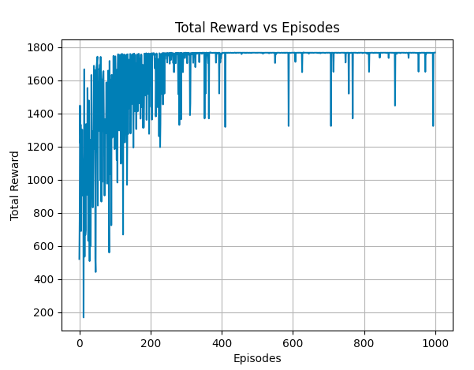

# Flight Price Prediction Using Q-Learning

This project aims to predict the best time to buy flight tickets using a Q-Learning algorithm.

## Project Structure

- `data/`: Contains raw and processed data.
- `notebooks/`: Jupyter notebooks for exploratory data analysis.
- `scripts/`: Python scripts for preprocessing, environment setup, Q-Learning training, and evaluation.
- `tests/`: Unit tests for the project.
- `main.py`: Main script to run the project.
- `requirements.txt`: Dependencies for the project.
- `setup.py`: Installation script for the project.

## Setup

1. Clone the repository:

   ```bash
   git clone https://github.com/yourusername/flight-price-qlearning.git
   cd flight-price-qlearning
   ```

2. Create and activate a virtual environment:

   ```bash
   python -m venv env
   source env/bin/activate  # On Windows use `env\Scripts\activate`
   ```

3. Install the required packages:
   ```bash
   pip install -r requirements.txt
   ```

## Usage

To preprocess data, train the model, and evaluate the policy:

```bash
# Preprocess Data
python main.py --step 1 --file_path data/raw/flight_prices.csv --output_path data/processed/preprocessed_flight_prices.csv

# Train Q-Learning Agent
python main.py --step 2 --file_path data/processed/preprocessed_flight_prices.csv --alpha 0.1 --gamma 0.95 --epsilon 0.1 --episodes 1000 --epsilon_decay 0.99 --min_epsilon 0.01

# Evaluate Policy
python main.py --step 3 --file_path data/processed/preprocessed_flight_prices.csv --q_table_path models/processed_q_table.npy

# Visualize Learning Process
python main.py --step 4 --rewards_path models/processed_rewards.npy
```

### Implementation Overview

This section provides a detailed overview of the implementation of the Q-Learning agent for predicting the best time to buy flight tickets. It includes the environment definition, agent definition, reward calculation, and the hyperparameters used in the training process.

#### Environment Definition

The environment is defined using the `FlightEnv` class, which represents the flight ticket buying scenario. The environment is responsible for:

- Managing the state of the agent, which includes the flight prices and other relevant features.
- Handling the agent's actions (buy or wait) and determining the resulting state and reward.
- Ensuring the episode ends when the agent reaches the end of the dataset or when a predefined maximum number of steps is reached.

The state consists of features such as the number of days until the flight, the base fare, total fare, and various encoded categorical variables representing the starting and destination airports, and the airline name.

#### Agent Definition

The agent is implemented using the `QLearningAgent` class. It utilizes the Q-Learning algorithm to learn the optimal policy for deciding when to buy a flight ticket. Key components of the agent include:

- **Q-Table:** A table that stores the estimated value (expected reward) of taking a particular action in a given state.
- **Epsilon-Greedy Policy:** A strategy for balancing exploration (trying new actions) and exploitation (choosing the best-known action). The agent starts with a higher exploration rate and gradually reduces it over time using an epsilon decay strategy.

The agent interacts with the environment by choosing actions based on the Q-values and updating the Q-table based on the rewards received.

#### Reward Calculation

The reward function is crucial for guiding the learning process. The rewards are calculated as follows:

- **Buy Action:** The reward is calculated based on the difference between the current price and the future price. If the agent buys the ticket at a lower price, it receives a positive reward. Otherwise, the reward is zero.
- **Wait Action:** The agent receives a small negative reward for waiting, to encourage decision-making rather than indefinite waiting.

The goal is to maximize the total reward, which aligns with buying the ticket at the lowest possible price.

#### Hyperparameters Used

The following hyperparameters are used in the Q-Learning algorithm:

- **Learning Rate (`alpha`):** Determines the extent to which new information overrides old information. A value of `0.1` is used.
- **Discount Factor (`gamma`):** Determines the importance of future rewards. A value of `0.95` is used.
- **Exploration Rate (`epsilon`):** The initial probability of choosing a random action (exploration). A value of `0.99` is used.
- **Epsilon Decay (`epsilon_decay`):** The rate at which the exploration rate decreases over time. A value of `0.999` is used.
- **Minimum Epsilon (`min_epsilon`):** The minimum value for the exploration rate to ensure the agent continues to explore occasionally. A value of `0.01` is used.
- **Number of Episodes (`episodes`):** The number of training episodes. A value of `1000` is used.
- **Maximum Steps per Episode (`max_steps`):** The maximum number of steps the agent can take in an episode. A value of `1000` is used.

These hyperparameters are chosen based on common practices in reinforcement learning and can be adjusted to experiment with different learning behaviors.

#### Results


